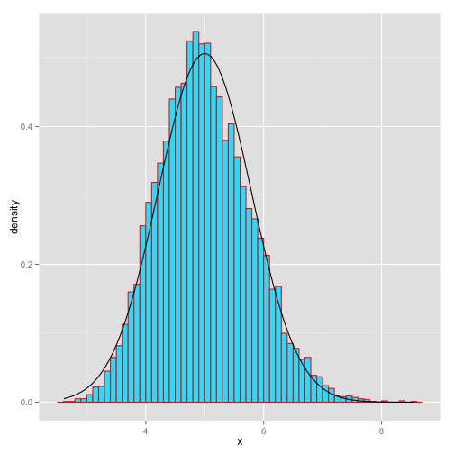

## **Reproducible Pitch Presentation**


### 1. Knowing "Data meets presentation"
### 2. Statistical inference and simulation
### 3. Data basic plot
### *  Hiperlink a Rpubs (http://rpubs.com/Rafael-Resendiz/RPP)


--- .class #id 

## 1. Knowing "Data meets presentation"

Load files and datasets and and have fun with them

```r
data(iris)  # Load data
lm(iris)    # Make a lineal regression
```

```
## 
## Call:
## lm(formula = iris)
## 
## Coefficients:
##       (Intercept)        Sepal.Width       Petal.Length  
##            2.1713             0.4959             0.8292  
##       Petal.Width  Speciesversicolor   Speciesvirginica  
##           -0.3152            -0.7236            -1.0235
```

--- .class #id 


## 2. Statistical inference and simulation
Setting the global options
Example: The exponential distribution

```r
lambda = 0.2           # lambda for all simulations
n = 40                 # number of exponential random variables
nsims = 1:10000        # number of simulated averages
set.seed(901)
means <- data.frame(x=sapply(nsims,function(x) {mean(rexp(n,lambda))})) # necessary means
head(means,2)          # show the results
```

```
##          x
## 1 3.981570
## 2 4.148078
```

```r
str(means)             # See a summary of the results
```

```
## 'data.frame':	10000 obs. of  1 variable:
##  $ x: num  3.98 4.15 5.38 7.41 5.73 ...
```

--- .class #id 


## Statistical inference in the real life


```r
fit <- lm(iris)   # Work with real data
confint(fit)      # Identify intercepts and others
```

```
##                        2.5 %      97.5 %
## (Intercept)        1.6182321  2.72430044
## Sepal.Width        0.3257653  0.66601260
## Petal.Length       0.6937939  0.96469395
## Petal.Width       -0.6140049 -0.01630542
## Speciesversicolor -1.1982739 -0.24885002
## Speciesvirginica  -1.6831329 -0.36386273
```

```r
summary(fit$residuals)
```

```
##      Min.   1st Qu.    Median      Mean   3rd Qu.      Max. 
## -0.794200 -0.218700  0.008987  0.000000  0.202500  0.731000
```

--- .class #id 
## Data basic plot
Plot your results and identify your creativity
 
